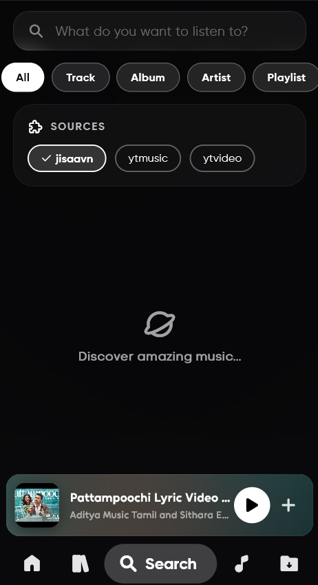
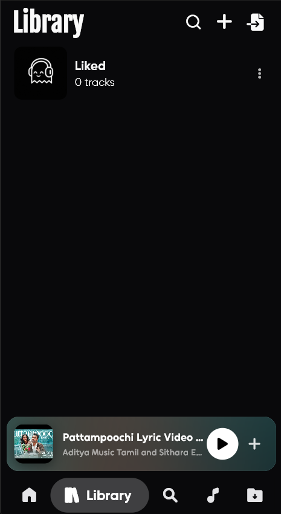
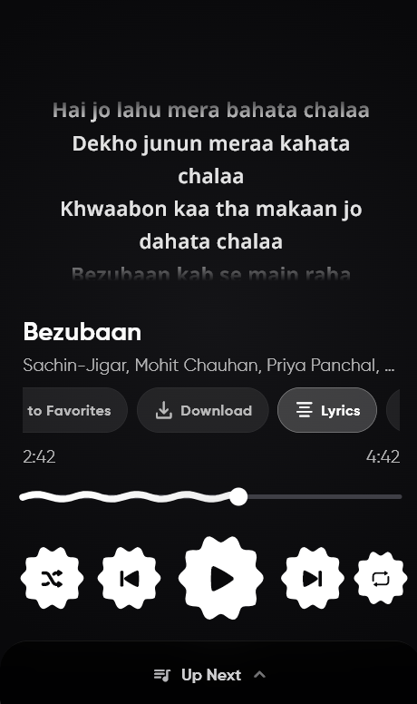
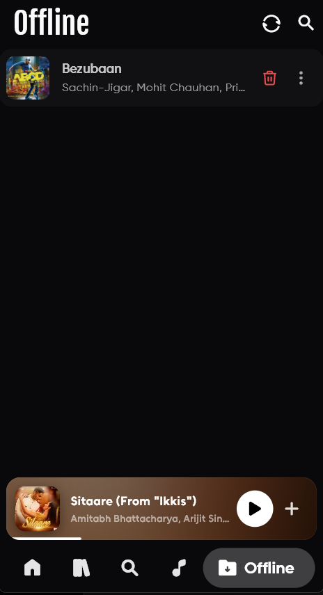
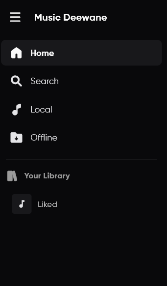
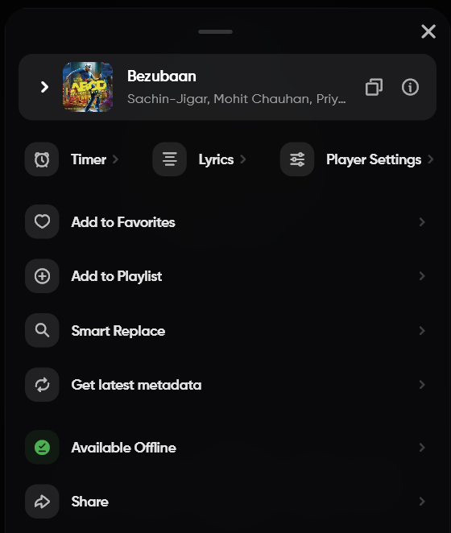
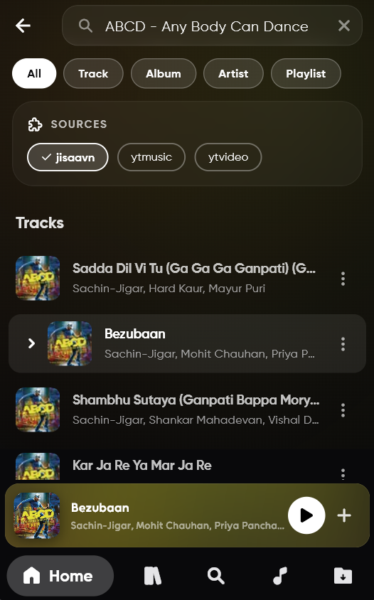
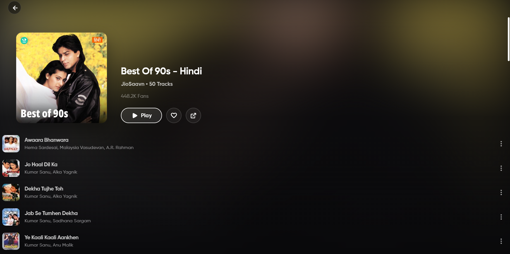
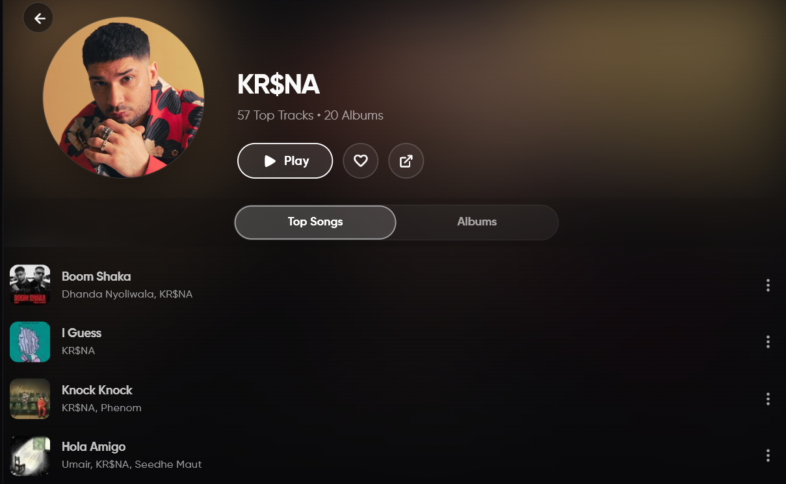

# 🎵 Music Deewane

**A unified local and plugin-first streaming music player built with Flutter & Rust.**

     

 **Music Deewane** is an experimental, open-source music player designed to give you absolute freedom over your audio. Seamlessly mix your **local device music** with an infinite universe of streams powered by a secure, **Rust-backed plugin system**. No ads, no interruptions—just your tunes, your way. 🎵

## 📸 Screenshots

> Screenshots from the official website (same images as [GitHub Pages](https://aditya452007.github.io/Music_Deewane/)) — now mirrored on `main` at `assets/website/` so the README renders directly on GitHub.

  

    
    
  

  

    
    
    
    
  

  

    
    
    
  

---
> ⚠️ **SECURITY WARNING: BEWARE OF FAKE WEBSITES!** ⚠️    
> The ONLY official source for Music Deewane is https://github.com/aditya452007/Music_Deewane. Do not trust other websites claiming to be official — unofficial sites may distribute modified APKs or malware. We are **not responsible** for any damage, privacy loss, or issues caused by downloading the app from third-party sources.
---

## 🚀 Features & Roadmap

- [x] 🚫 **Ad-Free Experience:** Zero interruptions, just pure music.
- [x] 🦀 **Plugins system:** Secure, auto-updating `.bex` plugin system for endless music sources.
- [x] 📂 **Local Music:** Play your local offline music seamlessly alongside online streams.
- [x] 🎤 **Karaoke-Style Lyrics:** Time-synced lyrics with manual offset adjustment.
- [x] 🎛️ **Audio Equalizer:** Built-in Equalizer and customizable Crossfade transitions.
- [x] 🔄 **Smart Replace:** Auto-recovery finds working streams if a playlist track goes dead.
- [x] 📊 **Last.fm Scrobbling:** Automatically log your listening history (includes offline caching).
- [x] 🎮 **Discord Rich Presence:** Show off your current tunes on your Discord profile.
- [x] 🌍 **Global Charts:** Daily updated charts from installed plugins.
- [x] 🖥️ **Cross-Platform:** Native media controls and shortcuts for Windows, Linux, and Android.
- [x] 💾 **Backup & Restore:** Easily export/import your library and settings via JSON or M3U.
- [x] 🤖 **AI-Based Recommendations:** Get smarter song suggestions (Last.fm/Plugin Based).
- [x] 🆎 **Multi-Language Support:** Localized app interface for global users *(Implementing more languages..)*

---
## 🌍 Language Support

| Language | Native Name | Status |
|----------|------------|--------|
| 🇮🇳 Hindi | हिन्दी | ✅ Complete |
| 🇺🇸 English | English | ✅ Complete |
| 🇰🇷 Korean | 한국어 | ✅ Complete |
| 🇩🇪 German | Deutsch | ✅ Complete |
| 🇪🇸 Spanish | Español | ✅ Complete |
| 🇯🇵 Japanese | 日本語 | ✅ Complete |

> 🟢 All translations are fully completed and maintained, Still if you feel any language needs more thought then please feel free to open the issue.
---

<h2 align="center">📥 Download & Install</h2>

<h4 align="center">Available for Android, Windows & Linux (Dev) 😍</h4>

  

---

## 🤝 Contribute to Music Deewane

**Every note counts!** Whether you're a seasoned developer or a beginner, your pull requests, bug reports, and feature suggestions are highly appreciated.

Contributing to Music Deewane is a great way to learn **Flutter, clean architecture, and BLoC patterns** in a real-world codebase.

1. **Discuss:** Open an Issue first to discuss your idea.
2. **Fork & Clone:** Fork the `main` branch.
3. **Branch & Build:** Create your feature branch.
4. **Pull Request:** Submit a PR and let your code join the Music Deewane symphony!

*Please read our [CONTRIBUTING.md](CONTRIBUTING.md) for detailed guidelines.*

---

## 📫 Get in Touch

Have questions, feedback, or just want to say hi? Connect with us here:

<i>Made with ❤️</i>

