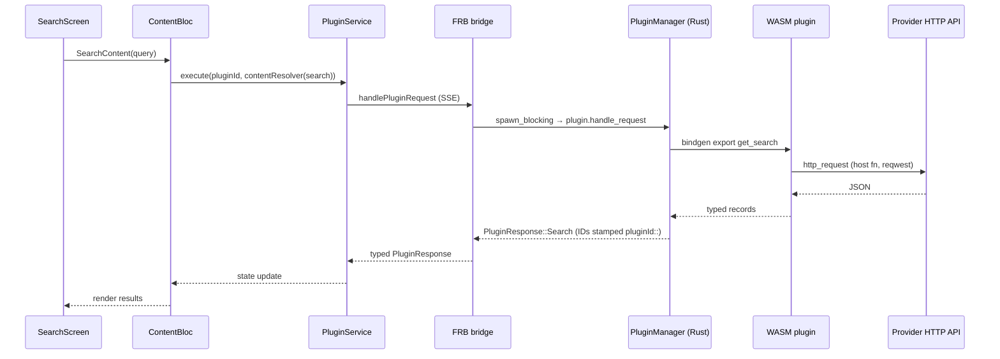

# Flow — Function Call Map & User Flows

> **Purpose**: The "how it works" file. Maps function calls, user journeys, request/response
> sequences, and routes. Reading this file gives an instant mental model of Music_Deewane.
>
> **Update rule (MANDATORY)**: Update whenever a function, component, hook, route, API, or
> flow changes. Never let it go stale — a stale diagram is worse than none.

---

## Overview

Music_Deewane is a Flutter music player: the UI (screens + blocs) requests content from a
Rust core via flutter_rust_bridge; the Rust core dispatches typed commands to WASM plugins
(resolvers/providers) that fetch real music data over HTTP; playback is done by media_kit
wrapped in audio_service. Everything user-owned (playlists, downloads, history, settings,
lyrics, plugin storage) persists in an Isar database.

---

## Architecture Diagram

```mermaid
graph TD
    subgraph Dart
        UI[screens/ widgets/] --> BL[blocs/ cubits]
        BL --> SVC[services/]
        SVC --> DAO[DAOs] --> DB[(Isar dbv3.isar)]
        SVC --> PS[PluginService] --> BR[lib/src/rust bridge]
        SVC --> PL[PlayerEngine media_kit]
        PL --> AS[audio_service / MPRIS / SMTC]
    end
    subgraph Rust (rust_lib_Bloomee)
        BR --> PM[PluginManager]
        BR --> DM[DownloadManager]
        PM --> WASM[WASM plugin components wasmi/waclay]
        WASM --> HTTP[reqwest blocking]
        DM --> HTTP
    end
    HTTP --> NET[Provider APIs / plugin repos]
    DAO --> LEGACY[legacy migration]
```

---

## User Flows (verified from code)

### Flow: App launch → gates → Home
1. `main()` (`lib/main.dart:152`): `MediaKit.ensureInitialized()` → `bootstrapApp()` → `setHighRefreshRate()` → `setupPlayerCubit()` (audio session → `AudioService.init` → `MusicDeewanePlayer`) → `DiscordService.initialize()` → `runApp`.
2. `MyApp.initState`: computes `_migrationPending` / `_onboardingPending` / `_pluginBootstrapPending`.
3. Gates in order: `LegacyMigrationOverlay` → `OnboardingOverlay` → `PluginBootstrapOverlay`; each `onComplete` re-checks the rest.
4. **Onboarding (ADR-037)**: single-step screen — Language + Country (auto-detect toggle, device-locale guess). Skip/Continue both call `_finish()`, which persists `SettingKeys.languageCode`/`countryCode`/`autoGetCountry` and marks onboarding done. (Music-language & artist selection steps were removed in ADR-037; favorite artists / music languages can still be edited via Settings → Manage Preferences.)
5. Spinner until player initialized → `MultiBlocProvider` (22 providers, including `RecommendationCubit`) → `MaterialApp.router` → `GlobalFooter` shell (5 tabs) → initial `/Explore`.
6. On resume: player health check (`revive()`), plugin repo sync (30-min cooldown).

### Flow: Home / Discovery
- **Section order** (ADR-026, ADR-027, ADR-030): DiscoverBar → QuickAccessChips → TopPicksWidget → ForYouSection → TabSongListWidget (Last.fm) → _HomeSectionsList (plugin sections).
- `QuickAccessChips` ← `LibraryItemsCubit` → horizontal scrollable pill row of user playlists (pinned first, then unpinned); tap → `context.pushNamed(RoutePaths.playlistView, extra: storageKey)`.
- `TopPicksWidget` ← `RecentlyCubit` → paginated grid (3×3 mobile, 5×4 desktop) via `PageView` + `GridView.count`; tap → `player.loadPlaylist(...)`; long press → `showMoreBottomSheet`; refresh button re-shuffles.
- `ForYouSection` (ADR-030, ADR-032) ← `RecommendationCubit` → tracks grouped by artist reason → each group: "Because you listened to [Artist]" header + paginated grid (3×3 mobile, 5×4 desktop) via `PageView` + `GridView.count`; tap → `player.loadPlaylist(...)`; long press → `showMoreBottomSheet`; refresh button recomputes scores.
- `ExploreScreen` → `ContentBloc.getHomeSections` → `PluginService.execute` → Rust `PluginManager` → active **content resolver** plugin `getHomeSections` → `HomeSections` → section cards; `LoadMoreHomeSectionItems` (pageToken) for infinite scroll.
- Recents: `RecentlyCubit` ← `HistoryDAO.watchHistory`; full history view via `HistoryView` (accessible from settings/notifications area).

### Flow: Search
- `SearchScreen` (own `ContentBloc` + `SearchSuggestionBloc`): typing → suggestions (debounced, DB history + suggestion plugin) → submit → `SearchContent(query, filter)` (300ms debounce + switchMap) → `PagedMediaItems` → results; scroll end → `LoadMoreSearchContent`.
- **Empty results (ADR-029)**: When 0 results returned, shows available content plugins as `ActionChip` source-switching buttons. Tapping a chip switches the active plugin and re-runs the search in-app. No external links.
- **Skeleton loading (ADR-028)**: `CircularProgressIndicator` replaced with `_SearchSkeleton` — 4 gray rounded rectangles with `AnimatedOpacity` pulse.
- Library search: `LibrarySearchCubit` → `PlaylistDAO.searchLibrary` (title contains, excludes system playlists).

### Flow: Content details (Artist / Album / Playlist)
- Entry via `TrackMetadataLinks` (tap artist/album/playlist name) → `tryParseMediaId` → plugin-loaded guard → push `ArtistView` / `AlbumView` / `OnlPlaylistView` (MaterialPageRoute, not go_router).
- Each view owns a `ContentBloc`: `LoadAlbumDetails`/`LoadMoreAlbumTracks`, `LoadArtistDetails`/`LoadMoreArtistAlbums`, `LoadPlaylistDetails`/`LoadMorePlaylistTracks`; save-to-library via `LibraryItemsCubit` (`LibraryDAO`); play via `loadPlaylist`.
- `GetRadioTracks` exists in ContentBloc (radio entry point UNKNOWN — likely artist view).

### Flow: Playback
1. Tap play → `MusicDeewanePlayer.loadPlaylist(playlist, idx, doPlay)` → `QueueManager` → `PlayerEngine.load/play` (media_kit dual-player).
2. Stream resolution: `MediaResolverService.resolve` — **offline first** (`DownloadDAO`) → else plugin `GetStreams` → `StreamQualitySelector` (quality pref + fallback chain, URL/header validity check).
3. `_preResolveNextTrack()` → `engine.preloadNext`; `_onTrackCompleted` → advance (loop-aware); auto-queue via `RelatedSongsManager` (`LoadMorePlaylistTracks`); unresolvable tracks → `SmartTrackReplacementService` (cross-plugin, setting-gated).
4. **Error recovery (ADR-028)**: First retry attempt shows brief "Having trouble..." toast. After 3 failed retries, message suggests "Try another source or use Smart Replace". When last track finishes, `MiniPlayerCubit.isCompleted` triggers "Queue finished. Add more music?" prompt linking to Search.
5. OS integration: `_broadcastPlaybackState` → audio_service `PlaybackState`/`MediaItem` (via `TrackAdapter`) → lock screen/notification/headset/Discord.
6. UI: `MiniPlayerWidget` (swipe prev/next, swipe-up opens player) → `PlayerOverlayWrapper` → `AudioPlayerView` (`player_screen.dart`) → `UpNextPanel` (queue), lyrics, segments, EQ, timer, like/download. Player UI (Void Monochrome, ADR-022): organic scalloped control buttons (`organic_player_control.dart`), white flower `PlayPauseButton` with ~900 ms play-burst, animated `WaveProgressBar` (undulating sine fill, flat white), no ambient artwork glow. **ADR-023**: all control buttons now white (matching play button); ±10s seek buttons flank prev/next; volume slider visible on tablet+desktop only; timer/lyrics/settings/external-link moved to `showMoreBottomSheet` (showPlayerActions flag). **ADR-025**: Controls follow Spotify/YouTube Music standard layout. Mobile (≤tablet): Line 1 = Shuffle | Prev | Play | Next | Repeat; Line 2 = Lyrics. Desktop (>tablet): Line 1 = Shuffle | -10s | Prev | Play | Next | +10s | Repeat | Volume slider. ±10s visible on desktop only. Inline lyrics auto-scrolls to center via `ScrollablePositionedList`. Loop popup uses `PopupMenuButton<int>` with `OrganicIconButton(onPressed: null)`. **ADR-035**: Player button layout redesigned. Mobile: Artwork (tap left = -10s, tap right = +10s) → Title/Artist → Scrollable action pills (Like, Download, Lyrics, Share, Queue, Timer, Add to Playlist) → Timeline → Transport (Shuffle|Prev|Play|Next|Repeat). Desktop: Artwork (tap left = -10s, tap right = +10s) → Title/Artist + scrollable action pills → Timeline → Transport + Volume slider. Like moved from title row to pills row. Lyrics moved from separate line to pill row. **ADR-036**: Desktop now uses same `_ActionPillsRow` as mobile (unified pill-style buttons) with `isDesktop` flag for larger spacing. Download button no longer closes player.

### Flow: Downloads & Offline
- `DownloaderCubit.downloadSong` → `RustDownloadService.enqueue` → Rust `DownloadManager` (resumable, retry/backoff, `.part` files, tag embedding) → events (`taskUpdated`/`taskCompletedPendingAck`/`taskRemoved`) → `DownloadDAO.putDownload` (TrackDB + `_DOWNLOADS` playlist + DownloadDB) → library refresh (600ms debounce).
- Offline tab (`OfflineScreen`) lists `state.downloaded`; playback resolves from local file first.

### Flow: Library
- `LibraryItemsCubit`: playlists CRUD (`PlaylistDAO`), likes (`Liked` playlist), history (`HistoryDAO.recordPlay` — 15s/40% rule via `RecentlyPlayedTracker`), saved remote collections (`LibraryDAO`), pin/reorder.
- `PlaylistView` (`CurrentPlaylistCubit`): staged hydration, 40/page infinite scroll, edit/reorder (`PlaylistEditView`), download-all, share/export (`ImportExportService` + `SharePlus`), delete.
- Add-to-playlist: `AddToPlaylistCubit` → `AddToPlaylistScreen` (optimistic per-playlist toggle with rollback).
- Local music: `LocalMusicCubit` → permission (Android MediaStore via photo_manager; desktop folder scan via Rust `scanAudioFiles`).

### Flow: Lyrics & Segments
- `LyricsCubit` (subscribes to player mediaItem): cache (`LyricsDAO`) → lyrics plugin per priority (`SettingKeys.lyricsPriority`) → search fallback via `CrossPluginResolver` (weighted scoring, min confidence 0.56) → `getLyricsById`; auto-save option.
- UI: `FullscreenLyricsView` (sync/offset mode, karaoke scroll via position stream, tap-to-seek); manual search via `LyricsSearchDelegate`.
- Segments: `showSegmentsSheet` → `getSegmentsForTrack` across loaded content plugins → tap-to-seek.

### Flow: Charts & Radio
- `ChartBloc`: `LoadCharts` (stale-while-revalidate), `LoadChartDetails`, `ForceRefreshChartDetails`, `PrefetchAllChartDetails`; `ChartItemResolver` resolves chart items to playable tracks (phased: typed resolve → broaden → cross-plugin corroboration, min 45% confidence).

### Flow: Import (URL / plugin / M3U / backup)
- Library → Import media → `ImportMediaFromPlatformsView`: plugin importer tiles → `ImportProcessScreen` (`ContentImportCubit` phases: checkUrl → fetchCollectionInfo → fetchTracks → resolve (concurrency 5, timeout 10s, minConfidence 0.45) → review → saveToLibrary → PlaylistDAO).
- M3U → `parseM3UToJson` → `ContentImportCubit.loadFromM3U`.
- Backup/restore: `ImportExportService.handleImportOrRestore` (Isar snapshot / legacy JSON / playlist JSON).
- Incoming share: Android/iOS `share_handler` → YouTube video plays immediately; YouTube playlist/Spotify → directs to Import screen.

### Flow: Legacy migration (first launch gate)
- `LegacyMigrationOverlay` gate (`migrationPending`) → `legacy_migration_service.runMigration` → `findLegacyDbLocation` (prefers `default.isar`/`default.isar.db` in support/documents dir, fallback `default.db` only when no state/migrated artifacts) → `_buildMigrationPlan` → migrate playlists / liked / downloads / collections / Last.fm → validate → rename `.migrated` + write `legacy_migration_state.json`.
- Download mapping fix: legacy download `mediaId` is looked up with `_stripYoutubePrefix` applied so `youtubeyt-1` matches the `yt-1` media item instead of silently dropping the download (see ADR-014).

### Flow: Recommendations (ADR-030)
- `RecommendationCubit` ← `HistoryDAO.getRawHistory(limit: 100)` → compute scores:
  1. **Recency**: exponential decay `e^(-daysAgo/7)` — today ≈ 1.0, 7 days ≈ 0.37, 30 days ≈ 0.013
  2. **Artist frequency**: count plays per artist from history
  3. **Artist boost**: tracks by top-10 most-played artists get 1.5x multiplier
  4. **Sort by score** → top 30 tracks → emit `RecommendationLoaded(tracks, reasons)`
- `ForYouSection` ← `RecommendationCubit` → horizontal scroll cards with "Because you listened to [artist]" context
- Watch: `HistoryDAO.watchHistory()` → auto-refresh recommendations on new plays
- `refresh()` method recomputes scores on demand

### Flow: Manage Preferences (ADR-030)
- Settings → Manage Preferences → `ManagePreferencesScreen`
- Two sections: Favorite Artists (search + select via ContentBloc) and Music Languages (multi-select chips)
- Save → `SettingsCubit.setFavoriteArtists()` + `setMusicLanguages()` → persist to DB → emit state

### Flow: Settings, Updates, Shortcuts
- `SettingsCubit`: 29 keys loaded in parallel, single emit; every setter persists (SettingsDAO string/bool K/V) + emits; EQ (10-band, presets, builtin/device source), crossfade, qualities, backup gate (≤1/day), music languages, favorite artists.
- Updates: `GlobalEventsCubit.checkForUpdates` → `music_deewane_updater_tools.getAppUpdates()` → GitHub releases API only (SourceForge fallback removed — ADR-045) → `isUpdateAvailable()` (version component-wise + raw build number comparison, no modulo) → `UpdateAvailable` state → `GlobalEventListener` shows update dialog with actual download URL from the GitHub release assets → **in-app download** (streaming progress) → platform install (OpenFilex on Android, Process.run on desktop). `NotificationCubit` only loads persisted notifications (no independent update check). Changelog "What's New" shows only when version AND build match (user is on latest version).
- Desktop keyboard shortcuts (`KeyboardShortcutsHandler`): media keys, Space, ←/→, ↑/↓, R, S, M, L, T, Alt+←/→ seek (10s, ADR-023), Esc/Backspace (Up Next → player → back).

---

## Request / Response Flows

### Plugin command (search example)


### Stream resolution → playback
```
MediaResolverService.resolve(track)
  → DownloadDAO.getDownloadRecord ? local file : PluginService.execute(GetStreams)
  → StreamQualitySelector (strmQuality pref, fallback chain, URL checks)
  → PlayerEngine.openDirect(uri, headers) / preloadNext()
```

### Plugin lifecycle & events
```
PluginBloc.InitializePluginSystem → PluginService.initialize → createPluginManager(pluginsDir)
  → PluginEventBus.connect(StreamSink<PluginManagerEvent>)
  → auto-load persisted IDs (SettingKeys.autoLoadPluginIds)
  → PluginStorageService: preload Isar → Rust; persist storageSet/Deleted events back
```

---

## Function Call Map

### Entry point
```
lib/main.dart (main)
  └─ bootstrapApp()                          lib/services/bootstrap.dart
       └─ RustLib.init() → paths → DBProvider.init + scheduleMaintenance
       └─ ServiceLocator.setup() → PluginBootstrapService.ensureHostedRepositoriesPresent
       └─ ServiceLocator.initializePluginSystem() → PluginService.initialize → PluginManager
       └─ local-music auto-scan (fire-and-forget)
└─ setupPlayerCubit() → setupAudioSession() → PlayerInitializer.getMusicDeewanePlayer()
        → MusicDeewanePlayer (BaseAudioHandler) → PlayerEngine + QueueManager + helpers
  └─ runApp(MyApp) → gates → MultiBlocProvider(21) → MaterialApp.router(GlobalRoutes.globalRouter)
```

### Playback chain
```
play request (any SongCardWidget/play button)
  └─ MusicDeewanePlayerCubit/player.loadPlaylist(Playlist, idx, doPlay)
       └─ QueueManager._loadQueue → engine.load(...) → engine.play()
       └─ MediaResolverService.resolve(next) → _preResolveNextTrack → engine.preloadNext
       └─ _onTrackCompleted → advance (LoopMode-aware) → RelatedSongsManager.append
```

### Player engine (media_kit)
```
MusicDeewanePlayer (lib/services/music_deewane_player.dart)
  └─ PlayerEngine (lib/services/player/player_engine.dart): dual Player A/B, crossfade,
       EQ (10-band), BehaviorSubjects: state/playing/position/duration/buffered/volume/speed
  └─ QueueManager (queue state, shuffle, loop, persistence → SettingKeys.lastQueueState)
  └─ RecentlyPlayedTracker (15s/40% → HistoryDAO.recordPlay)
  └─ PlayerErrorHandler (retry circuit: 3 attempts, 4s/1s backoff)
```

### Plugin system (Dart ↔ Rust)
```
PluginService.execute / install / load / unload          lib/services/plugin/plugin_service.dart
  └─ bridge fns (lib/src/rust/api/bridge.dart) → Rust PluginManager (rust/src/api/plugin/plugin.rs)
       └─ adapters → bindgen exports → WASM component (wasmi via waclay)
  └─ events → PluginEventBus → PluginBloc / PluginStorageService
PluginBootstrapService (first-run + 30-min sync): repositories.json → bex-factory.json (Music_Deewane_factory releases) → .bex download → install
Plugin IDs use `musicdeewanefactory` publisher (ADR-043): {type}.musicdeewanefactory.{name} (e.g. content-resolver.musicdeewanefactory.jisaavn)
```

### Downloads
```
DownloaderCubit → RustDownloadService.initialize(pluginManager, stateDir, tempDir)
  → bridge.createDownloadManager → Rust DownloadManager (semaphore, retry, resume)
  → events → _handleDownloadEvent → DownloadDAO.putDownload → _DOWNLOADS playlist
```

---

## Route Map (go_router — `lib/routes/app_router.dart`)

| Route | Screen | Purpose |
|-------|--------|---------|
| `/Explore` (initial) | ExploreScreen | Home: sections, charts, recents |
| `/Explore/ChartScreen` | ChartScreen (qp: pluginId, chartId, chartTitle) | Chart detail |
| `/Library` | LibraryScreen | Playlists + saved collections |
| `/Library/ImportMediaFromPlatforms` | ImportMediaFromPlatformsView | Import entry |
| `/Library/ImportProcess` | ImportProcessScreen (qp: pluginId) | Import wizard |
| `/Library/PlaylistView` | PlaylistView (extra: playlistName) | User playlist detail |
| `/Search` | SearchScreen (qp: query) | Global search |
| `/LocalMusic` | LocalMusicScreen | Local files |
| `/Offline` | OfflineScreen | Downloads/offline |
| `/AddToPlaylist` | AddToPlaylistScreen (root-level, above shell) | Add track to playlist |

Not go_router (pushed via `Navigator.push(MaterialPageRoute)`): AlbumView, ArtistView, OnlPlaylistView, SettingsView + sub-views, NotificationView, TimerView, HistoryView, PlaylistEditView, FullscreenLyricsView, SongInfoScreen.

---

## Frontend Site Routes (GitHub Pages)

| Route | Page | Purpose |
|-------|------|---------|
| `/` | index.html | Main landing page: hero, features, stats, download, open source |
| `/privacy.html` | Privacy Policy | Data handling, third-party services, developer disclaimer |
| `/terms.html` | Terms & Conditions | Open source license, user responsibilities, liability |

**Static assets**: `css/style.css`, `js/main.js`, `assets/logo.png`, `robots.txt`, `sitemap.xml`

## CI/CD Workflow Maps

```mermaid
graph TD
    Trigger[Push to main / workflow_dispatch] --> CI[checkout.yml: CI Checks]
    Trigger --> Android[release-android.yml: Android Build]
    Trigger --> Windows[release-windows.yml: Windows Build]
    Trigger --> Linux[release-linux.yml: Linux Build]

    subgraph "Android Pipeline (Ubuntu)"
        Android --> A1[Setup Java 17, Rust, Flutter]
        A1 --> A2[flutter build apk --release]
        A2 --> A3[Package music_deewane_android_v{version}.apk]
        A3 --> A4[ncipollo/release-action@v1]
    end

    subgraph "Windows Pipeline (Windows)"
        Windows --> W1[Setup Rust, Flutter]
        W1 --> W2[flutter build windows --release]
        W2 --> W3[Create MSIX]
        W3 --> W4[Install Inno Setup]
        W4 --> W5[Compile Inno Setup Installer]
        W5 --> W6[Package zip]
        W6 --> W7[Upload zip + msix + exe to release]
    end

    subgraph "Linux Pipeline (Ubuntu)"
        Linux --> L1[Setup Rust, Flutter, C++ Toolchain]
        L1 --> L2[flutter build linux --release]
        L2 --> L3[Package music_deewane_linux_*.tar.gz]
        L3 --> L4[ncipollo/release-action@v1]
    end
```

## External Services (network endpoints)

| Service | Endpoint / ID | Used by |
|---------|--------------|---------|
| Last.fm API | `ws.audioscrobbler.com/2.0/` (MD5-signed) | Scrobbling, charts (user keys) |
| Last.fm auth | `last.fm/api/auth` (browser token flow) | `ScrobbleRepository` |
| Plugin catalogue | `https://aditya452007.github.io/Music_Deewane/repositories.json` (ghpage branch) → `https://github.com/aditya452007/Music_Deewane_factory/releases/latest/download/bex-factory.json` | `PluginBootstrapService` |
| Plugin repos | user-added HTTP JSON + `.bex` downloads | `PluginRepositoryService` |
| Updater | `https://api.github.com/repos/aditya452007/Music_Deewane/releases/latest` (GitHub only — ADR-045), `https://aditya452007.github.io/Music_Deewane/CHANGELOG.md` | `music_deewane_updater_tools` |
| Download page | `https://github.com/aditya452007/Music_Deewane/releases` (fallback) | Update dialog |
| Geo/country | `ipwho.is/`, `api.country.is/`, `ipapi.co/json/`, `ip-api.com/json` | Country allowlist (`CountryInfoService`) |
| Discord RPC | app id `1339113296405725235` | `DiscordService` (desktop) |
| Music data | **none in repo** — via WASM plugins' own HTTP | plugins only |

## State Flow

1. Widgets never own app state — cubits/blocs are provided at root (21) or per-screen (ContentBloc, ChartBloc, LibrarySearchCubit).
2. `MusicDeewanePlayerCubit` is global (`main.dart`), wraps `MusicDeewanePlayer`; exposes `progressStreams` (Rx.combineLatest4) and queue/mediaItem streams; UI subscribes via streams, mutates via direct player calls.
3. Persistence: cubit setters → repositories → DAOs → Isar; DB watchers drive reactive lists (history, library, downloads).
4. Rust events (plugin lifecycle, download tasks) flow in via broadcast buses → blocs → UI.
5. **Network state (ADR-028)**: `ConnectivityCubit` (root-provided) drives `OfflineBanner` overlay in `GlobalFooter`. Banner slides in/out via `AnimatedContainer`. Reconnection triggers auto-dismiss snackbar via `BlocConsumer` listener.

---

## Update Protocol (MANDATORY)

Update this file when any of the following change:

- [ ] New, renamed, or removed function / widget / bloc / route
- [ ] Call chain between functions changed
- [ ] New user flow or a change to an existing flow
- [ ] New or removed external service/endpoint
- [ ] New dependency in a call chain (library, service)
- [ ] State management approach changed
